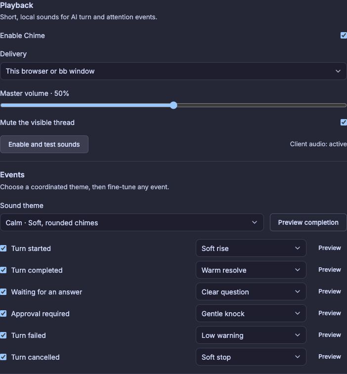

# Chime

[](https://github.com/gtramontina/bb-plugin-chime/actions/workflows/ci.yml)

Chime is a [bb](https://github.com/get-bb/bb) plugin that plays calm, configurable notification sounds when AI turns start, finish, fail, pause for a question, or request approval.

## Settings



## Features

- Six independently configurable events: started, completed, question, approval, failed, and best-effort cancellation.
- Client-local audio in [bb](https://github.com/get-bb/bb) desktop windows and browser clients.
- Best-effort leader election prevents duplicate sounds across tabs on the same origin.
- Optional macOS server playback through `/usr/bin/afplay`.
- Calm, Glass, Wood, and Minimal sound themes with per-event customization.
- Master volume, visible-thread muting, and a project mute denylist.
- One-second storm suppression prioritizes questions, approvals, and failures.
- Events older than five seconds are discarded after reconnects.
- No telemetry, message content, error text, or durable event history.

## Install for development

```sh
npm install --include=dev
npm run generate:sounds
bb plugin install .
bb plugin dev
```

Open **Settings → Plugins → Chime**, choose **Enable and test sounds**, then save your preferences.

## Browser audio

Browsers require a user gesture before allowing audio. Chime attempts to unlock audio on the first pointer or keyboard interaction, and the settings page reports whether playback is active or blocked.

Leader election is scoped to one browser origin. A local [bb](https://github.com/get-bb/bb) window and a remote [bb](https://github.com/get-bb/bb) client use different origins, so both may sound. This is intentional: sound follows the device where each client is open.

## Server playback

Server playback is available when [bb](https://github.com/get-bb/bb) runs on macOS and `/usr/bin/afplay` exists. It plays on the server machine, not necessarily the machine displaying a remote [bb](https://github.com/get-bb/bb) client. Client playback remains the portable default.

## Event semantics

- **Started** corresponds to a thread entering its active state for a turn.
- **Completed** corresponds to the thread returning to idle.
- **Question** and **approval** are detected from pending interactions and deduplicated by interaction ID.
- **Failed** corresponds to the thread error transition; error text is never placed in Chime's queue.
- **Cancelled** is inferred from the latest `system/thread/interrupted` event with reason `manual-stop`. If [bb](https://github.com/get-bb/bb) does not expose enough history, Chime falls back to completed.

## Development

```sh
npm test
npm run typecheck
npm run build
npm run smoke:live
```

Sound files contain no third-party samples. They are original assets synthesized and generated deterministically by `scripts/generate-sounds.mjs`, and are distributed under this repository's MIT license.
The live smoke test expects [bb](https://github.com/get-bb/bb) at `http://127.0.0.1:38886`; override it with `CHIME_BB_BASE_URL`.

## License

MIT
